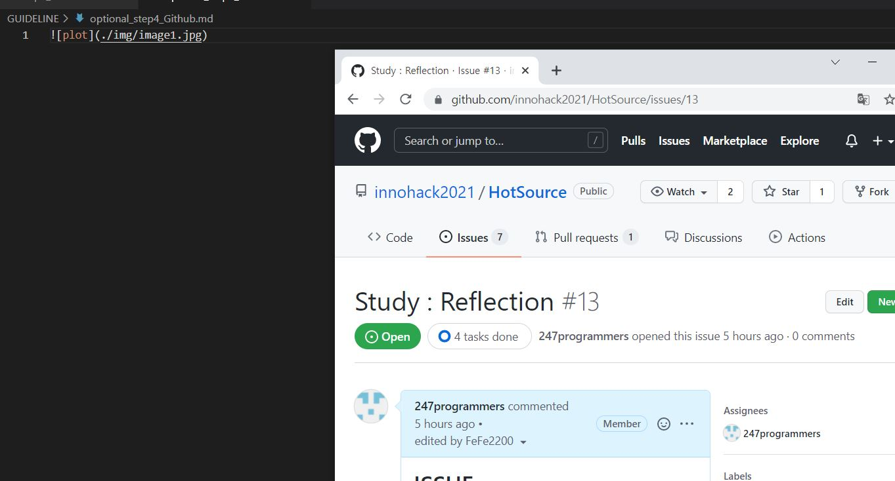

이미지 이름 꼭 대문자로!!

깃허브 협업!!! 방법
======================

    프로젝트를 위해서는 협업이 불가피하다. 그렇기에 협업을 위한 github 사용법을 숙지할 필요가 있다.

    필자는 github의 기본 동작 git add/ git commit/ git push/ 정도만 사용해보고, 구체적인 협업방법은 모르고 있었다.

    해커톤을 통해 어떤식으로 협업을 하는지, 어떻게 파일들을 관리해야하는지를 이해했다.

    이 글을 읽는 독자도 깃허브에 한 발 더 나아가 훌륭한 개발자로 도약하길 바란다.

목차
------

### 기본적인 커밋방법

    1. 자료 Fork
 
    2. 내 github에서 로컬 저장소로 클론

    3. Branch 생성 및 변경

    4. Add & Commit & Push

    5. Fetch & Merge

    6. Pull Request 

    7. 관리자가 Merge

### 이슈가 생겼을 때

    1. Issue 발행

    2. 코드 commit 후 PR 작성

    3. 관리자가 Merge

* ### 1.자료 Fork
    > 협업을 시작 할 때, 자료를 복사하여 자기 저장소로 가져와야 한다.

    > 그렇기에 일단 협업을 할 프로젝트 레포지토리로 이동한 뒤, fork 버튼을 눌러 fork 한다.

    > 사진과 같이 레포지토리에서 fork 버튼을 찾아 자신의 레포지토리에 fork한다.

    > 그러면 자신의 레포지토리에 fork된 레포지토리가 생길 것이다.

* ### 2. 내 github에서 로컬 저장소로 클론

    > 이 작업은 기존에 많이 했던 클론작업이라 크게 어렵지 않다.

    > ssh 키를 등록이 안되어있다면 ssh-keygen으로 ssh키를 발급받고

    > cat ~/.ssh/id_rsa.pub 의 값을 자신의 레포지토리의 ssh 키 관리 세팅 창에서 추가한다.

## 
-------------------------------
    클론하는 방법. 레포지토리에서 code를 누른 후 ssh 주소를 복사한다.
    git clone {주소}를 터미널에서 타이핑하면 클론이 된다.

## 
--------------------
    ssh키가 자신의 레포지토리에 추가되어있지않을 떼 추가하는 방법
    자세한 것은 인터넷에 자료가 많으니 찾아보기 권장
    settings -> SSH and GPG keys에 들어가면 된다.

