깃허브 협업!!! 방법
======================

    프로젝트를 위해서는 협업이 불가피하다. 그렇기에 협업을 위한 github 사용법을 숙지할 필요가 있다.

    필자는 github의 기본 동작 git add/ git commit/ git push/ 정도만 사용해보고, 구체적인 협업방법은 모르고 있었다.

    해커톤을 통해 어떤식으로 협업을 하는지, 어떻게 파일들을 관리해야하는지를 이해했다.

    이 글을 읽는 독자도 깃허브에 한 발 더 나아가 훌륭한 개발자로 도약하길 바란다.

<br/>
<br/>

목차
<br/>
<br/>
<br/>
------

## 기본적인 커밋 방법

    1. 자료 Fork
 
    2. 내 github에서 로컬 저장소로 클론

    3. Branch 생성 및 변경

    4. Add & Commit & Push

    5. Fetch & Merge

    6. Pull Request 

    7. 관리자가 Merge


## 이슈가 생겼을 때

    1. Issue 발행

    2. 코드 commit 후 PR 작성

    3. 관리자가 Merge

<br/>
<br/>

## 기본적인 커밋 방법

<br/>
<br/>

* ### 1. 자료 Fork
    > 협업을 시작 할 때, 자료를 복사하여 자기 저장소로 가져와야 한다.

    > 그렇기에 일단 협업을 할 프로젝트 레포지토리로 이동한 뒤, fork 버튼을 눌러 fork 한다.

    > 사진과 같이 레포지토리에서 fork 버튼을 찾아 자신의 레포지토리에 fork한다.

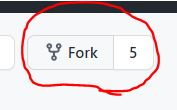

    > 그러면 자신의 레포지토리에 fork된 레포지토리가 생길 것이다.

<br/>
<br/>

* ### 2. 내 github에서 로컬 저장소로 클론

    > 이 작업은 기존에 많이 했던 클론작업이라 크게 어렵지 않다.

    > ssh 키를 등록이 안되어있다면 ssh-keygen으로 ssh키를 발급받고

    > cat ~/.ssh/id_rsa.pub 의 값을 자신의 레포지토리의 ssh 키 관리 세팅 창에서 추가한다.


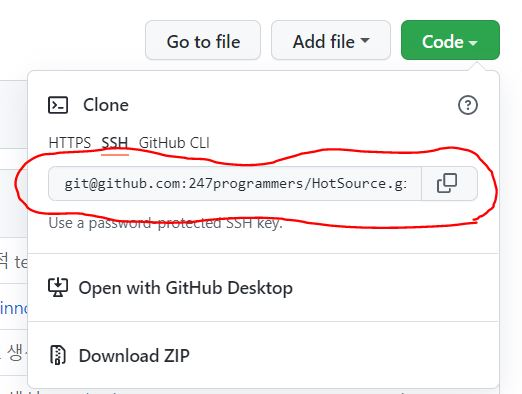
-------------------------------


    클론하는 방법. 레포지토리에서 code를 누른 후 ssh 주소를 복사한다.
    git clone {주소}를 터미널에서 타이핑하면 클론이 된다.

    
<br/>
<br/>
<br/>

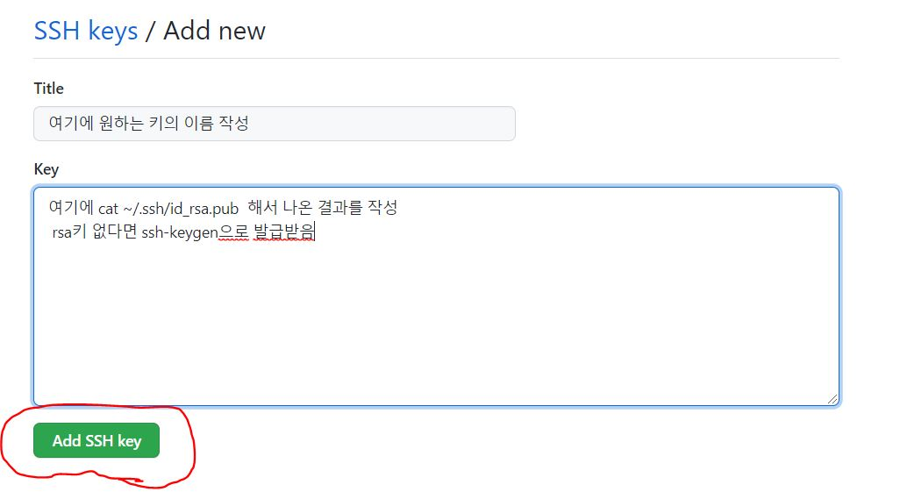

--------------------
    ssh키가 자신의 레포지토리에 추가되어있지않을 떼 추가하는 방법
    자세한 것은 인터넷에 자료가 많으니 찾아보기 권장
    settings -> SSH and GPG keys에 들어가면 된다.

<br/>

<br/>
<br/>

* ### 3. Branch 생성 및 변경
    > Branch를 생성하는 방법은 $ git branch branchName main 명령어를 사용하여

    > 만들고자 하는 브런치이름을 branchName에 작성하고, main 은 분기해 나올 branch를 작성한다.

    > 본 프로젝트의 기본 branch는 main이기 때문에 main을 넣었다.

<br/>
<br/>
<br/>

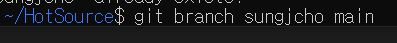

    git branch sungjcho main


    > 변경하기 위해서는 switch 명령을 사용하여, 브런치 변경 후 작업을 해야 한다.

    > 현재 컴퓨터 깃 버전이 2.17.1 이라, git checkout 명령을 사용해야 브런치 명 변경이 가능하다.

<br/>
<br/>
<br/>

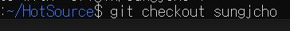


    git checkout sungjcho


<br/>
<br/>
<br/>

* ### 4. Add & Commit & Push
    
```
git add .
git commit -m "commit message "
git push
```
간단하게 푸쉬한다.
<br/>
<br/>
<br/>
<br/>
<br/>

* ### 5. Fetch & Merge
    > 레포지토리와 연동을 위해 병합해야한다.

    <br/><br/><br/>

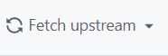

> 레포지토리에서 fetch upstream 클릭

<br/><br/><br/>


> 그 후 Fetch and Merge 클릭

> 그러면 로컬과 자신의 레포지토리가 같아질 것이다.

<br/>
<br/><br/><br/><br/>

* ### 6. Pull Request 
    > main에 자신의 코드를 병합하기 위해서는 pull 을 요청해야 한다.

    > 자신의 레포지토리에 변화가 생기면 compare and pull request 버튼이 활성화된다.

<br/><br/><br/>

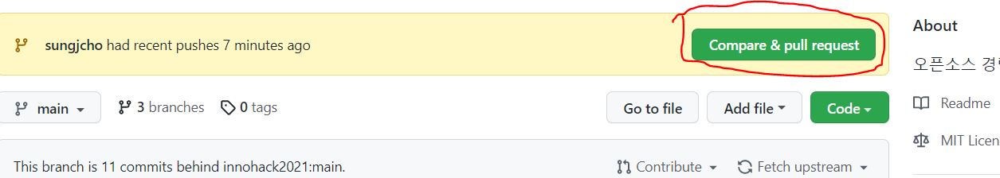

    > 클릭 후 여러 가지 작성

<br/><br/><br/><br/><br/><br/>


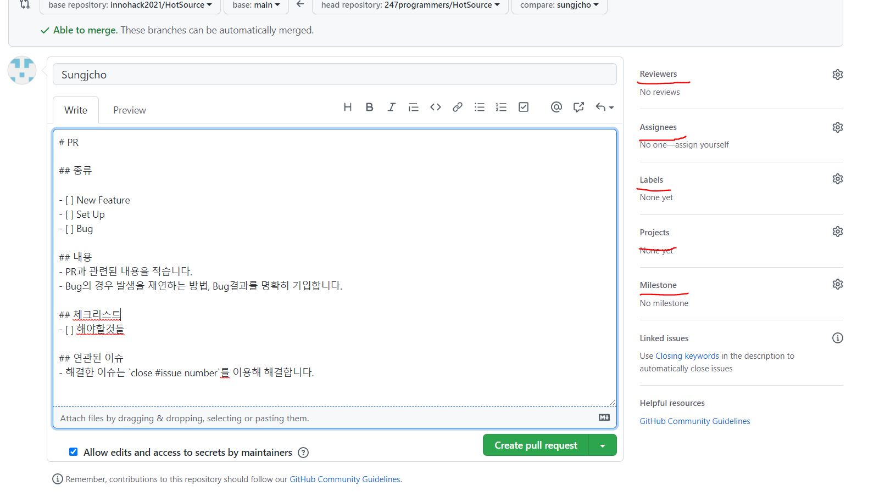

    > 종류 : 이 문서의 경우 참고자료 작성이기 때문에 setup으로 선택

    > 내용 : PR의 세부내용을 적는다.

    > 체크리스트 : PR 리뷰 중 체크해야 할 리스트들을 작성해둔다.

    > 연관된 이슈 : 관련 이슈를 작성한다. ex) #issue 13

    > Reviewers : pull request 를 리뷰하여 merge할 사람을 정한다.

    > Assignees : 이 작업에 할당된 사람을 적는다. 안쓴다면 자신이 default이다.

    > Labels : 중요도, 카테고리를 라벨을 달아둔다. 그러면 pull request 확인 시 빠르게 작업이 가능하다.

    > Projects : 프로젝트를 선택한다. 기본적으로 자신이 수행하는 프로젝트를 선택한다.

    > Milestone : 진행의 척도를 확인하기 위해 milestone을 사용한다. 배포 버전이 정해졌을 때, 커밋을 합침. 

    > 그렇게 되면 commit log에 내용을 볼 수 없기 때문에 milestone은 특정 기간의 이슈들을 묶는 역할을 한다.

<br/>
<br/>
<br/><br/><br/>

* ### 7. 관리자가 Merge

#### 최종적으로 Merge를 해야, Main이든 어디든 병합되어 프로젝트가 완성된다.
#### 협업을 하기 위해서는 Merge가 필수적이며, 실수하지 않게 조심해야 한다.

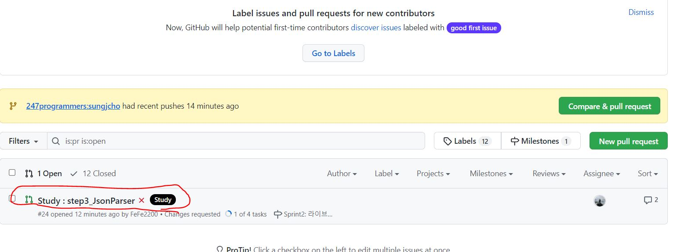

    > (관리자 입장) PR요청이 오면 리스트가 나오고, 클릭한다.

<br/><br/><br/>

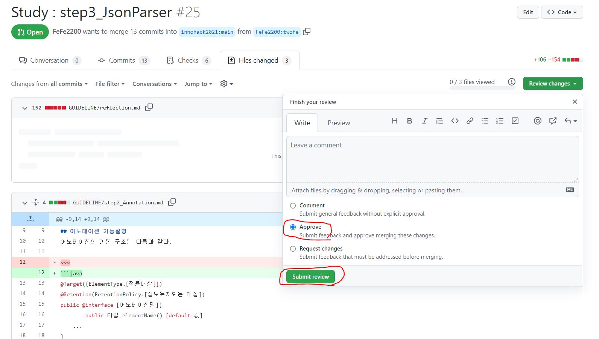

> PR내용을 확인하기 위해 File changed 를 클릭한다.

> Review changes를 누르고

> 1. 코멘트를 달기위해 comment를 쓰거나,  2. 승인하기위해 approve 를 누르거나, 3. 작업 변경을 거절하거나 선택한다.


<br/><br/><br/>

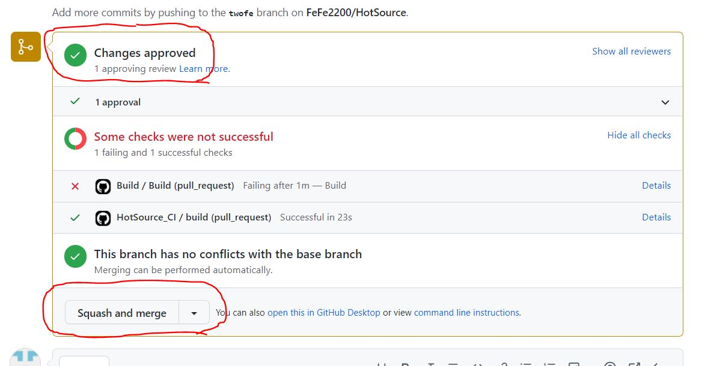

> 승인하면 changed approved가 나오고, 최종적으로 Merge하기 위해 Squash and merge를 누른다.


<br/><br/><br/>


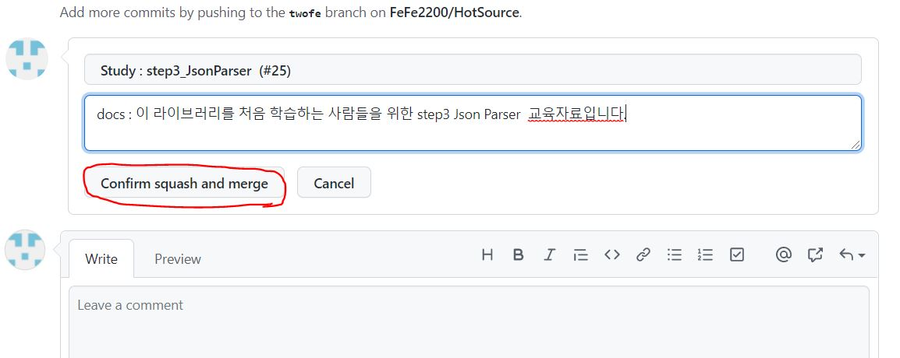

> 마지막으로 comment와 confirm Squash and merge를 누르면 Merge가 된다.

<br/>

<br/>

<br/><br/><br/><br/>

## 이슈가 생겼을 때 

<br/>

### 협업 중 이슈가 생기면, 그것을 해결하기 위해 여러 사람들이 볼 수 있도록 issue card를 발행한다.

<br/>
<br/><br/><br/>

> 1. Issue card 발행

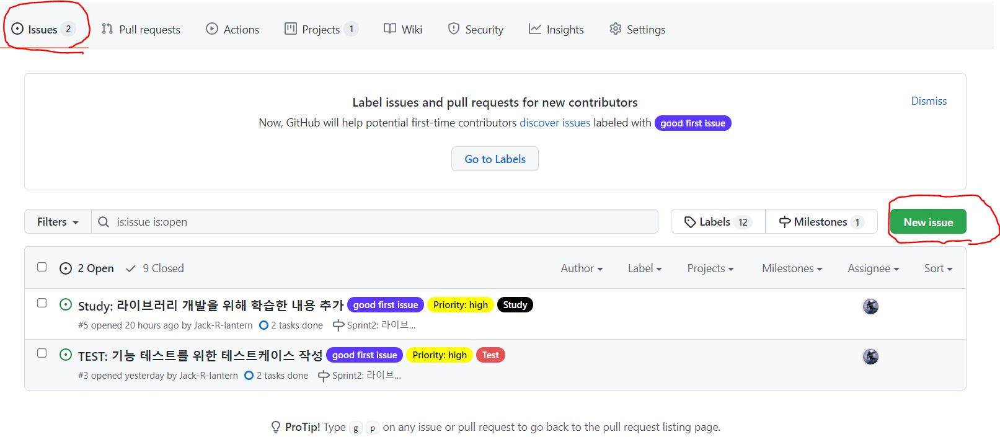


> 첫 번째로 레포지토리의 issue를 클릭하여 이슈 창으로 이동한다.

> 그 후 new issue를 클릭하여 새로운 이슈를 발행한다.

<br/><br/><br/><br/>


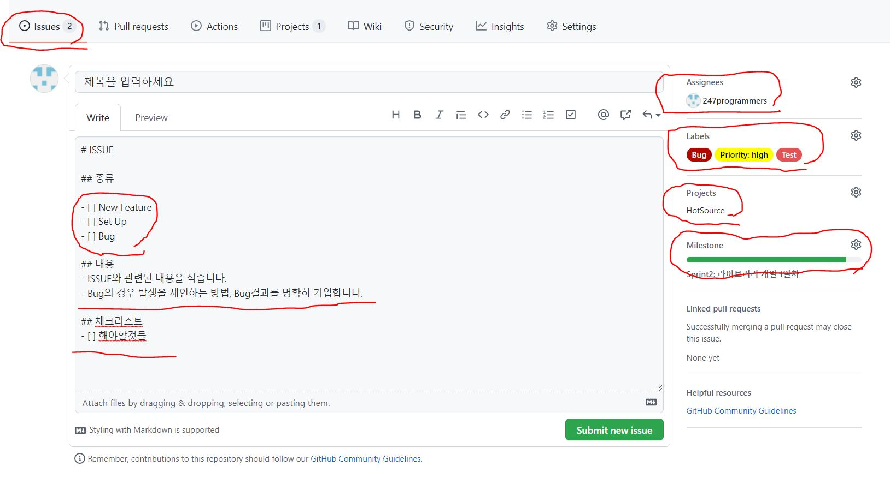

> PR과 비슷하게 이슈카드를 발행한다. 종류, 내용, 체크리스트를 적고 이 이슈를 해결할사람, 라벨을 달아준다. 

<br/>
<br/><br/><br/>

    2. 코드 commit 후 PR 작성

    > PR은 위에서 발행한 PR과 같이 진행한다.

<br/>
<br/>

    3. 관리자가 Merge

    > Merge는 위에서 관리자 Merge작업과 동일하게 진행한다.
    
